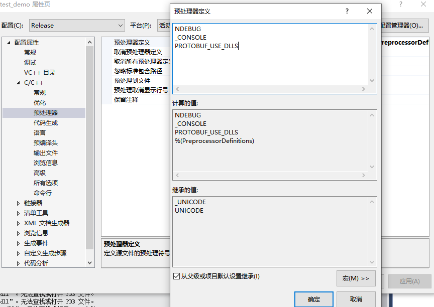
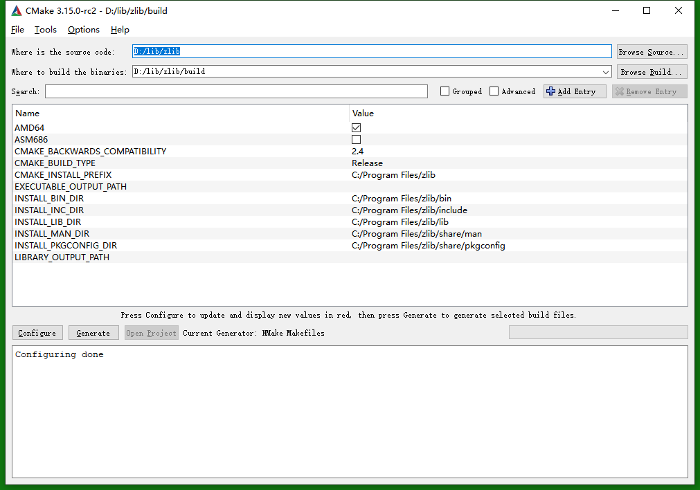

序
==========

之前在u版本下安装第三方库比较熟悉，没有走太多弯路，但是windows下对应的版本安装和依赖相对复杂，做一点总结

有的依赖namke 命令行生成
有的依赖cmake生成*.sln的vs工程文件
有的是依赖脚本生成工程文件
等等
上诉几种方式本质都是依赖于windosw的cl.exe编译器
有的第三方方式可能会依赖cmake和git，但是最终生成的工程或者命令行都要执行命令就是c1.exe编译器去执行编译

说道c1.exe编译器不得不说一点问题，就是在编译工程时候我们要对应去选择32/64位的编译选项，以及debug/release选项，稍有不慎，就会导致链接出错。
还有就是引入库时候有一点特别要注意的和linux区别比较大的一个地方就是  **预定义宏**  这个可能是在代码中define定义，也可能是预编译宏定义选项去定义，这个是一个开关可能直接导致 库文件是否能真的被导入。这里我加一张图，下次一定注意了，不要在此处浪费过多时间。



在过程中很重要的一点就是环境变量了，个人任务windows维护了更为复杂的环境，所以默认配置中并没有明确指认我们调用工具的版本，而是让我们自己去选定一些工具运行的环境，这里就比较依赖于vs自带的ide集成工具了，请不要小瞧这些工具，比如vs2015 x64兼容命令工具 ，兼容说明了它丰富的多边形，可以是vs2010，可以是vs2019，每套工具集成自己的环境，供我们调用，包括cl.exe编译器和其他一些依赖库头文件等等，在繼承環境下才能構建正確的工程，正確的調用ide和一些插件比如cmake等。



通常的开源项目也是依赖这些环境对工程进行构建，比较专业。


下面举例是protobuf3.8.0的编译方式，仅仅对关键点用了中文解释。
这个文档真的完整（来自pb的源码，cmake路径下的readme.md），思维紧密，对windows工程认识比较深刻才能有如此的文章，为作者点赞。


#### 🤫

下面是官方文档中的编译手册，我基于的版本是V3.8.0
里面编译构建过程考虑的比较完善，有助于对windows项目运行机制的理解
没有做翻译，原版虽然读起来耗时一点，但是这种方式却是让我们最少走弯路的方式。

 

第三方工具的依赖
=================

This directory contains *CMake* files that can be used to build protobuf
with *MSVC* on *Windows*. You can build the project from *Command Prompt*
and using an *Visual Studio* IDE.

You need to have [CMake](http://www.cmake.org), [Visual Studio](https://www.visualstudio.com)
and optionally [Git](http://git-scm.com) installed on your computer before proceeding.

Most of the instructions will be given to the *Сommand Prompt*, but the same
actions can be performed using appropriate GUI tools.

Environment Setup(环境设置) 粗体字都是重点
=================

Open the appropriate *Command Prompt* from the *Start* menu.
(用命令行启动程序，这样启动后同时也配置了程序环境变量)
For example *VS2013 x64 Native Tools Command Prompt*:

    C:\Program Files (x86)\Microsoft Visual Studio 12.0\VC\bin\amd64>

Change to your working directory:

    C:\Program Files (x86)\Microsoft Visual Studio 12.0\VC\bin\amd64>cd C:\Path\to
    C:\Path\to>

Where *C:\Path\to* is path to your real working directory.

Create a folder where protobuf headers/libraries/binaries will be installed after built:

    C:\Path\to>mkdir install

If *cmake* command is not available from *Command Prompt*, add it to system *PATH* variable:

    C:\Path\to>set PATH=%PATH%;C:\Program Files (x86)\CMake\bin

If *git* command is not available from *Command Prompt*, add it to system *PATH* variable:

    C:\Path\to>set PATH=%PATH%;C:\Program Files\Git\cmd

Good. Now you are ready to continue.

Getting Sources（获取源码）
===============

You can get the latest stable source packages from the release page:

    https://github.com/protocolbuffers/protobuf/releases/latest

For example: if you only need C++, download `protobuf-cpp-[VERSION].tar.gz`; if
you need C++ and Java, download `protobuf-java-[VERSION].tar.gz` (every package
contains C++ source already); if you need C++ and multiple other languages,
download `protobuf-all-[VERSION].tar.gz`.

Or you can use git to clone from protobuf git repository.

     C:\Path\to> git clone -b [release_tag] https://github.com/protocolbuffers/protobuf.git

Where *[release_tag]* is a git tag like *V3.8.0* or a branch name like *master*
if you want to get the latest code.

Go to the project folder:

     C:\Path\to>cd protobuf
     C:\Path\to\protobuf>

Remember to update any submodules if you are using git clone (you can skip this
step if you are using a release .tar.gz or .zip package):
（请注意下载依赖模块）

```console
C:\Path\to> git submodule update --init --recursive
```

Now go to *cmake* folder in protobuf sources:

     C:\Path\to\protobuf>cd cmake
     C:\Path\to\protobuf\cmake>

Good. Now you are ready to *CMake* configuration.

CMake Configuration（cmake 配置选项）
===================

*CMake* supports a lot of different
[generators](http://www.cmake.org/cmake/help/latest/manual/cmake-generators.7.html)
for various native build systems.
We are only interested in
[Makefile](http://www.cmake.org/cmake/help/latest/manual/cmake-generators.7.html#makefile-generators)
and
[Visual Studio](http://www.cmake.org/cmake/help/latest/manual/cmake-generators.7.html#visual-studio-generators)
generators.

We will use shadow building to separate the temporary files from the protobuf source code.

Create a temporary *build* folder and change your working directory to it:

     C:\Path\to\protobuf\cmake>mkdir build & cd build
     C:\Path\to\protobuf\cmake\build>

The *Makefile* generator can build the project in only one configuration, so you need to build
a separate folder for each configuration.

To start using a *Release* configuration:

     C:\Path\to\protobuf\cmake\build>mkdir release & cd release
     C:\Path\to\protobuf\cmake\build\release>cmake -G "NMake Makefiles" ^
     -DCMAKE_BUILD_TYPE=Release ^
     -DCMAKE_INSTALL_PREFIX=../../../../install ^
     ../..


（注： ^符号是表示换行，  ../..表示找到cmake所在目录）
（注： 跳过以上步骤其实也可以编译，但是缺少了很多配置选项，工程不够灵活）
It will generate *nmake* *Makefile* in current directory.

To use *Debug* configuration:

     C:\Path\to\protobuf\cmake\build>mkdir debug & cd debug
     C:\Path\to\protobuf\cmake\build\debug>cmake -G "NMake Makefiles" ^
     -DCMAKE_BUILD_TYPE=Debug ^
     -DCMAKE_INSTALL_PREFIX=../../../../install ^
     ../..

It will generate *nmake* *Makefile* in current directory.

To create *Visual Studio* solution file:

     C:\Path\to\protobuf\cmake\build>mkdir solution & cd solution
     C:\Path\to\protobuf\cmake\build\solution>cmake -G "Visual Studio 14 2015 Win64" ^
     -DCMAKE_INSTALL_PREFIX=../../../../install ^
     ../..

It will generate *Visual Studio* solution file *protobuf.sln* in current directory.

If the *gmock* directory does not exist, and you do not want to build protobuf unit tests,
you need to add *cmake* command argument `-Dprotobuf_BUILD_TESTS=OFF` to disable testing.

To make a *Visual Studio* file for Visual Studio 15 2017, create the *Visual Studio*
solution file above and edit the CmakeCache file.

	C:Path\to\protobuf\cmake\build\solution\CMakeCache

Then create the *Visual Studio* solution file again

Compiling（编译/静默编译/ide编译）
=========

To compile protobuf:

     C:\Path\to\protobuf\cmake\build\release>nmake

or

     C:\Path\to\protobuf\cmake\build\debug>nmake

And wait for the compilation to finish.

If you prefer to use the IDE:

  * Open the generated protobuf.sln file in Microsoft Visual Studio.
  * Choose "Debug" or "Release" configuration as desired.
  * From the Build menu, choose "Build Solution".

And wait for the compilation to finish.

Testing
=======

To run unit-tests, first you must compile protobuf as described above.
Then run:

     C:\Path\to\protobuf\cmake\build\release>nmake check

or

     C:\Path\to\protobuf\cmake\build\debug>nmake check

You can also build project *check* from Visual Studio solution.
Yes, it may sound strange, but it works.

You should see output similar to:

     Running main() from gmock_main.cc
     [==========] Running 1546 tests from 165 test cases.

     ...

     [==========] 1546 tests from 165 test cases ran. (2529 ms total)
     [  PASSED  ] 1546 tests.

To run specific tests:

     C:\Path\to\protobuf>cmake\build\release\tests.exe --gtest_filter=AnyTest*
     Running main() from gmock_main.cc
     Note: Google Test filter = AnyTest*
     [==========] Running 3 tests from 1 test case.
     [----------] Global test environment set-up.
     [----------] 3 tests from AnyTest
     [ RUN      ] AnyTest.TestPackAndUnpack
     [       OK ] AnyTest.TestPackAndUnpack (0 ms)
     [ RUN      ] AnyTest.TestPackAndUnpackAny
     [       OK ] AnyTest.TestPackAndUnpackAny (0 ms)
     [ RUN      ] AnyTest.TestIs
     [       OK ] AnyTest.TestIs (0 ms)
     [----------] 3 tests from AnyTest (1 ms total)

     [----------] Global test environment tear-down
     [==========] 3 tests from 1 test case ran. (2 ms total)
     [  PASSED  ] 3 tests.

Note that the tests must be run from the source folder.

If all tests are passed, safely continue.

Installing
==========

To install protobuf to the specified *install* folder:

     C:\Path\to\protobuf\cmake\build\release>nmake install

or

     C:\Path\to\protobuf\cmake\build\debug>nmake install

You can also build project *INSTALL* from Visual Studio solution.
It sounds not so strange and it works.

This will create the following folders under the *install* location:
  * bin - that contains protobuf *protoc.exe* compiler;
  * include - that contains C++ headers and protobuf *.proto files;
  * lib - that contains linking libraries and *CMake* configuration files for *protobuf* package.

Now you can if needed:
  * Copy the contents of the include directory to wherever you want to put headers.
  * Copy protoc.exe wherever you put build tools (probably somewhere in your PATH).
  * Copy linking libraries libprotobuf[d].lib, libprotobuf-lite[d].lib, and libprotoc[d].lib wherever you put libraries.

To avoid conflicts between the MSVC debug and release runtime libraries, when
compiling a debug build of your application, you may need to link against a
debug build of libprotobufd.lib with "d" postfix.  Similarly, release builds should link against
release libprotobuf.lib library.

DLLs vs. static linking
=======================

Static linking is now the default for the Protocol Buffer libraries.  Due to
issues with Win32's use of a separate heap for each DLL, as well as binary
compatibility issues between different versions of MSVC's STL library, it is
recommended that you use static linkage only.  However, it is possible to
build libprotobuf and libprotoc as DLLs if you really want.  To do this,
do the following:

  * Add an additional flag `-Dprotobuf_BUILD_SHARED_LIBS=ON` when invoking cmake
  * Follow the same steps as described in the above section.
  * When compiling your project, make sure to `#define PROTOBUF_USE_DLLS`.

When distributing your software to end users, we strongly recommend that you
do NOT install libprotobuf.dll or libprotoc.dll to any shared location.
Instead, keep these libraries next to your binaries, in your application's
own install directory.  C++ makes it very difficult to maintain binary
compatibility between releases, so it is likely that future versions of these
libraries will *not* be usable as drop-in replacements.

If your project is itself a DLL intended for use by third-party software, we
recommend that you do NOT expose protocol buffer objects in your library's
public interface, and that you statically link protocol buffers into your
library.

ZLib support
============

If you want to include GzipInputStream and GzipOutputStream
(google/protobuf/io/gzip_stream.h) in libprotobuf, you will need to do a few
additional steps.

Obtain a copy of the zlib library.  The pre-compiled DLL at zlib.net works.
You need prepare it:

  * Make sure zlib's two headers are in your `C:\Path\to\install\include` path
  * Make sure zlib's linking libraries (*.lib file) is in your
    `C:\Path\to\install\lib` library path.

You can also compile it from source by yourself.

Getting sources:

     C:\Path\to>git clone -b v1.2.8 https://github.com/madler/zlib.git
     C:\Path\to>cd zlib

Compiling and Installing:

     C:\Path\to\zlib>mkdir build & cd build
     C:\Path\to\zlib\build>mkdir release & cd release
     C:\Path\to\zlib\build\release>cmake -G "NMake Makefiles" -DCMAKE_BUILD_TYPE=Release ^
     -DCMAKE_INSTALL_PREFIX=../../../install ../..
     C:\Path\to\zlib\build\release>nmake & nmake install

You can make *debug* version or use *Visual Studio* generator also as before for the
protobuf project.

Now add *bin* folder from *install* to system *PATH*:

     C:\Path\to>set PATH=%PATH%;C:\Path\to\install\bin

You need reconfigure protobuf with flag `-Dprotobuf_WITH_ZLIB=ON` when invoking cmake.

Note that if you have compiled ZLIB yourself, as stated above,
further disable the option `-Dprotobuf_MSVC_STATIC_RUNTIME=OFF`.

If it reports NOTFOUND for zlib_include or zlib_lib, you might haven't put
the headers or the .lib file in the right directory.

If you already have ZLIB library and headers at some other location on your system then alternatively you can define following configuration flags to locate them:

	-DZLIB_INCLUDE_DIR=<path to dir containing zlib headers>
	-DZLIB_LIB=<path to dir containing zlib>

Build and testing protobuf as usual.

Notes on Compiler Warnings
==========================

The following warnings have been disabled while building the protobuf libraries
and compiler.  You may have to disable some of them in your own project as
well, or live with them.

* C4018 - 'expression' : signed/unsigned mismatch
* C4146 - unary minus operator applied to unsigned type, result still unsigned
* C4244 - Conversion from 'type1' to 'type2', possible loss of data.
* C4251 - 'identifier' : class 'type' needs to have dll-interface to be used by
  clients of class 'type2'
* C4267 - Conversion from 'size_t' to 'type', possible loss of data.
* C4305 - 'identifier' : truncation from 'type1' to 'type2'
* C4355 - 'this' : used in base member initializer list
* C4800 - 'type' : forcing value to bool 'true' or 'false' (performance warning)
* C4996 - 'function': was declared deprecated

C4251 is of particular note, if you are compiling the Protocol Buffer library
as a DLL (see previous section).  The protocol buffer library uses templates in
its public interfaces.  MSVC does not provide any reasonable way to export
template classes from a DLL.  However, in practice, it appears that exporting
templates is not necessary anyway.  Since the complete definition of any
template is available in the header files, anyone importing the DLL will just
end up compiling instances of the templates into their own binary.  The
Protocol Buffer implementation does not rely on static template members being
unique, so there should be no problem with this, but MSVC prints warning
nevertheless.  So, we disable it.  Unfortunately, this warning will also be
produced when compiling code which merely uses protocol buffers, meaning you
may have to disable it in your code too.
